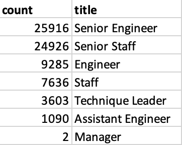

# Employee Database Retirement Analysis

## Overview
The purpose of this project was to build an employee database from multiple CSV files and use that database to analyze employee data to help a company plan for upcoming retirements and position vacancies. An initial analysis looked at the total number of employees eligible for retirement and the number of potential retirements by department and at the department manager level. The current analysis examined the number of potential retirements by position title as well as the number of current employees who may be eligible to participate in a mentorship program to help prepare them for more senior positions.

## Results

The employee database was built using [PostgreSQL](schema.sql) from the following six CSV files: [employees](Data/Original/employees.csv), [departments](Data/Original/departments.csv), [department employees](Data/Original/dept_emp.csv), [department managers](Data/Original/dept_manager.csv), [titles](Data/Original/titles.csv), and [salaries](Data/Original/salaries.csv). [PostgreSQL queries](Queries/Employee_Database_Challenge.sql) were used to retrieve and examine data relevant to upcoming retirements.

### Retirements by Title
The first table below shows the number of employees eligible for retirement for each position title. This table is available as a [CSV file](Data/retiring_titles.csv), as is the full [CSV file of employees eligible for retirement with current title](Data/unique_titles.csv). The second table below shows the total number of current employees for each position. From the tables below, we can see the following:
-    The company has 72,458 employees with upcoming eligibility for retirement. This represents about 30% of its 240,124 current employees, which is a significant portion of its existing workforce.
-    The majority (50,842, or 70%) of retirement-eligible employees are in senior engineer or senior staff positions. Senior engineers and senior staff also represent the largest proportion of the company’s total current staff. Thirty percent of senior engineers and senior staff are eligible for retirement, mirroring the company’s overall percentage of retirement-eligible employees.
-    The company has only nine current staff in the position of manager, two (22%) of whom are eligible for retirement.

**Number of Employees Eligible for Retirement by Title**

**Number of Current Employees by Title**

### Mentorship Eligibility
Current employees were identified as eligible for mentorship based on having been born in 1965. A complete CSV file of employees eligible for mentorship can be accessed [here](Data/mentorship_eligibility.csv). Below is a table showing the number of employees eligible for mentorship by position title. From this table, we can see the following:
-    There are staff eligible for mentorship across all position titles except manager.
-    The large majority (1,443, or 93%) of staff eligible for mentorship are in senior staff, senior engineer, staff, and engineer positions. Based on the current criteria, 71% (1098) of all staff identified as eligible for mentorship are already in senior positions.

**Number of Employees Eligible for Mentorship by Title**

## Summary

### How many roles will need to be filled as the “silver tsunami” begins to make an impact?
As noted above, more than 72,000 positions held by retirement-eligible employees will need to be filled as those employees retire. The greatest number of vacancies will be in the positions of senior engineer and senior staff, which also represent the largest proportion of the company’s total employees. In addition to considering the position titles held by retirement-eligible employees, it is important to consider the departments in which they work, since the specific role of an employee depends as much on their department as their title. As shown in the table below, the departments with the most retirement-eligible employees are Development, Production, and Sales, accounting for 63% of all employees eligible for retirement.

**Number of Employees Eligible for Retirement by Department**

It is also important to note that all of the company’s current employees were born in 1965 or earlier, so the company must focus on recruiting new talent over the next 10 years as the current employees advance towards retirement.

### Are there enough qualified, retirement-ready employees in the departments to mentor the next generation of company employees?
With mentorship eligibility limited to employees born in 1965, there would be sufficient retirement-ready employees in each department to mentor the current mentorship-eligible employees in their department. Additional queries were used to create a table of mentorship-eligible employees along with their department, as well as a table with the number of mentorship-eligible employees by department, as shown below. Comparing the table below with the one above showing the number of retirement-eligible employees by department, we can clearly see that each department has many more retirement-eligible employees than mentorship-eligible ones.

**Number of Employees Eligible for Mentorship by Department**

However, as noted above, the majority of employees identified as eligible for mentorship based on the birthdate criteria alone are already in senior positions, so they may not be the employees most in need of mentorship. It may be more appropriate to identify employees for mentorship based on a birthdate range from 1960 to 1965 and a current position of staff, engineer, or assistant engineer. The table below shows the number of employees meeting those new criteria by department. Based on these new numbers, there would still be sufficient retirement-ready employees in each department to mentor the mentorship-eligible employees in their department.

**Number of Employees Eligible for Mentorship by Department**

Again, it is important to note that as the company is recruiting new employees to fill positions vacated through retirement or promotion, those new employees will likely be the ones most in need of mentorship.
